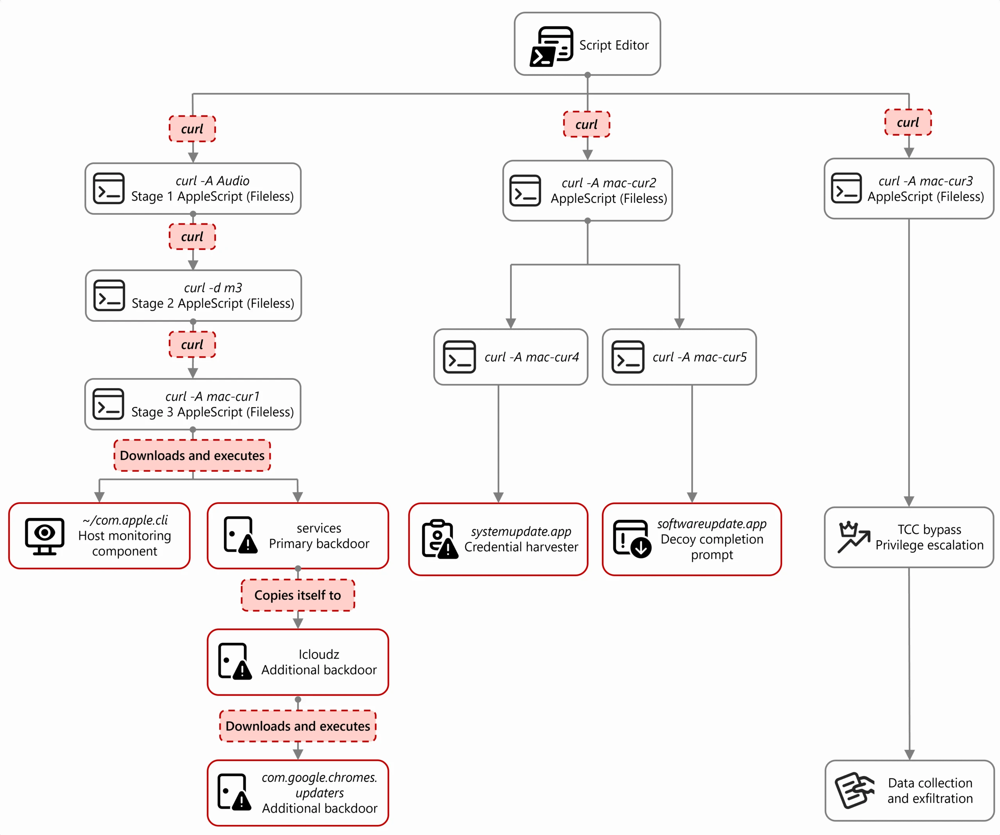

# Lab 1 — Cyber Threat Intelligence (CTI) Report Mapping to MITRE ATT&CK

## Group Members
* Bar Levy

## Source CTI Report
https://www.microsoft.com/en-us/security/blog/2026/04/16/dissecting-sapphire-sleets-macos-intrusion-from-lure-to-compromise/

## Short Attack Summary
We analyzed a recent macOS-focused campaign by the North Korean group Sapphire Sleet. Instead of using zero-day vulnerabilities, the attackers used social engineering to trick victims (mostly in the crypto/finance sector) into downloading a fake "Zoom SDK Update". When the victim opened the AppleScript file, it triggered a chain of dynamic downloads via `curl`. The malware bypassed macOS security checks like TCC, popped up a fake system dialog to steal the user's password, and exfiltrated sensitive data like browser databases, Telegram sessions, and crypto wallets to the attacker's server.

## Attack Diagram / Sequence

## MITRE ATT&CK Mapping

| Tactic | Technique | Behavior from Report | ATT&CK Link |
| :--- | :--- | :--- | :--- |
| **Initial Access** | User Execution: Malicious File (T1204.002) | The attackers tricked the user into manually executing a malicious `.scpt` file that looked like a Zoom update. | [T1204.002](https://attack.mitre.org/techniques/T1204/002/) |
| **Execution** | Command and Scripting Interpreter: AppleScript (T1059.002) | `osascript` was heavily used to run the initial lure and to launch further terminal commands dynamically fetched via `curl`. | [T1059.002](https://attack.mitre.org/techniques/T1059/002/) |
| **Credential Access** | GUI Input Capture (T1056.002) | A fake native macOS password prompt (`systemupdate.app`) was shown to the user to capture and verify their password against `dscl`. | [T1056.002](https://attack.mitre.org/techniques/T1056/002/) |
| **Defense Evasion** | Impair Defenses: Disable or Modify Tools (T1562.001) | The malware modified the user's `TCC.db` file using `sqlite3` to secretly give `osascript` permissions without the OS alerting the user. | [T1562.001](https://attack.mitre.org/techniques/T1562/001/) |
| **Persistence** | Create or Modify System Process: Launch Daemon (T1543.004) | A malicious `.plist` file was created in `/Library/LaunchDaemons` so the backdoor runs every time the Mac boots. | [T1543.004](https://attack.mitre.org/techniques/T1543/004/) |
| **Collection** | Data from Local System (T1005) | A script collected local data including Chromium browser profiles, Telegram desktop session files, Apple Notes, and SSH keys. | [T1005](https://attack.mitre.org/techniques/T1005/) |
| **Exfiltration** | Archive Collected Data: Utility (T1560.001) | The collected data was zipped into archives inside the `/tmp/` directory before being uploaded to the attacker's C2 server using `curl` with `nohup`. | [T1560.001](https://attack.mitre.org/techniques/T1560/001/) |

## Insights / What You Learned
This lab showed us how effective "Living off the Land" (LotL) attacks are. The threat actor didn't need a crazy exploit; they just used built-in Mac tools like `curl`, `zip`, `sqlite3`, and `osascript`. We also saw that strong OS protections like TCC can be completely bypassed if the attacker manages to trick the user into granting that initial execution foothold.